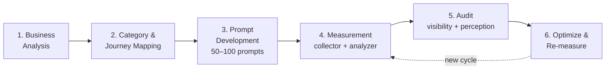

# Brand Prompt Framework — From Business Analysis to AI Visibility Audit

**Author:** Antonio Blago
**Version:** 1.0
**Status:** Companion framework to the [LLM Brand Visibility Study](methodology.md)

This framework turns **any brand** into a measurable prompt set for LLM visibility tracking. While [methodology.md](methodology.md) documents the statistical study design, this document describes the **repeatable end-to-end workflow** you run for a new brand or market:



Ready-to-use system prompts and templates for every phase live in [`prompts/templates/`](../prompts/templates/).

---

## Quick Start

**With Claude Code** — the repo ships a skill ([`.claude/skills/prompt-framework/`](../.claude/skills/prompt-framework/SKILL.md)) that executes each phase; open the repo in Claude Code and run:

```
/prompt-framework analyze <brand> <website>   # Phase 1
/prompt-framework categories                  # Phase 2
/prompt-framework develop 60                  # Phase 3 (50-100 prompts)
/prompt-framework measure 30                  # Phase 4 (asks before spending API budget)
/prompt-framework audit                       # Phase 5
```

`/prompt-framework full <brand> <website>` runs all phases in sequence with confirmation stops. Work products land in `data/framework/<brand-slug>/` (gitignored).

**Without Claude Code** — the manual path through the same phases:

| Step | What to do | Tooling |
|------|-----------|---------|
| 1 | Fill the Phase 1 context + competitor tables | Manually, or paste [system-prompt-simple.de.md](../prompts/templates/system-prompt-simple.de.md) / [system-prompt-advanced.de.md](../prompts/templates/system-prompt-advanced.de.md) into a Custom GPT / Claude Project |
| 2 | Pick 3–7 categories, plan the ~60/40 Type A/B split (Phase 2) | Manually |
| 3 | Write prompts into `prompts/<category>.yaml` (Type A only) | Copy [prompt-set.template.yaml](../prompts/templates/prompt-set.template.yaml) |
| 4 | Register brand + competitors and clusters in `config.yaml`, then `python -m src.collector --runs 30 && python -m src.analyzer` | This repo's pipeline |
| 5 | Build the visibility + perception audit from `results/` (Phase 5) | Manually; Type B prompts via [tracking-prompts.md](../prompts/templates/tracking-prompts.md) in a tracking tool |
| 6 | Fix gaps with GEO levers, re-measure with the frozen prompt set (Phase 6) | Monthly/quarterly cycle |

---

## Phase 1 — Business Analysis

**Goal:** Capture everything needed to generate prompts that reflect real buyer behavior — before writing a single prompt.

### 1.1 Context capture

Required fields (the minimum to start):

| Field | Description | Example |
|-------|-------------|---------|
| **Brand** | Brand name as it should be detected | PURELEI |
| **Industry** | Sector / vertical | E-commerce / jewelry |
| **Products** | Product categories under study | Gold jewelry, necklaces, rings |
| **Audience** | Who buys? (B2B/B2C, demographics, mindset) | B2C, women 25–45, fashion-conscious |
| **Perspective** | Whose voice do prompts speak in? | End customer (first person) |
| **User problem** | The problem the product solves | Uncertainty about material origin |
| **Market / region** | Geographic + language focus | DACH, German |

Optional fields (improve prompt quality):

| Field | Why it helps |
|-------|--------------|
| **Website URL** | Enables automated website research (1.2) |
| **Known competitors** | Seeds the competitor analysis (1.3) |
| **USP** | Needed for the perception audit (Phase 5.2) |
| **Tracking interval** | Determines re-measurement cadence (Phase 6) |

### 1.2 Website research

Crawl or read the brand website and extract:

- Industry and positioning
- Product categories and hero products
- Target audience (inferred from tone, imagery, offer)
- USP and brand promise
- Competitors mentioned on the site

Procedure: homepage → "About us" → product category pages → footer (certifications, partners).

### 1.3 Competitor analysis

Identify **5–10 competitors** — they become the comparison set for share-of-voice and are added to `config.yaml` as tracked brands.

Search queries that surface competitors:

- `"[industry] brands [market]"`
- `"[product] online shop [market]"`
- `"[brand] alternatives"`
- `"best [product category] brands"`

Capture per competitor:

| Competitor | Website | Type (direct/indirect) | Positioning | Hero products | USP | Audience |
|------------|---------|------------------------|-------------|---------------|-----|----------|

Also record: shared themes across competitors, differentiation potential for your brand, and recurring competitor keywords — these feed directly into Phase 2 categories.

> Automation: the [advanced system prompt](../prompts/templates/system-prompt-advanced.de.md) runs 1.1–1.3 as a guided workflow (website research + agent-mode competitor analysis) inside a Custom GPT / Claude Project.

---

## Phase 2 — Category & Journey Mapping

**Goal:** Decide *what* to measure (topic categories) and *where in the funnel* (journey stages) before generating prompts.

### 2.1 Monitoring categories

Derive **3–7 categories** from the business analysis. Typical candidates:

sustainability · product quality · price/value · design & style · service & experience · innovation · use cases · gifts & occasions

Each category becomes one prompt cluster (one YAML file in `prompts/`).

### 2.2 Customer journey stages

Tag every prompt with a journey stage:

| Stage | User state | Typical question patterns |
|-------|-----------|---------------------------|
| **Awareness** | Has a problem, no solution yet | What is…? Why does…? |
| **Consideration** | Compares options | Which differences…? Pros and cons…? |
| **Decision** | Ready to buy | Who offers…? Where to buy…? Which provider…? |
| **Retention** | Is a customer | How to use…? How to care for…? |
| **Advocacy** | Recommends | Why do people recommend…? What makes … special? |

The study's four clusters map onto this: *informational* ≈ Awareness, *commercial* ≈ Decision, *navigational* ≈ brand-adjacent Decision, *comparison* ≈ Consideration.

### 2.3 Prompt types: generic vs. branded

| Type | Brand in prompt? | Measures | Share |
|------|------------------|----------|-------|
| **Type A — Generic** | No | Is the brand mentioned organically? At which rank? | ~60% |
| **Type B — Branded** | Yes | Which attributes does the model associate with the brand? | ~40% |

> **Important:** The core study pipeline (mention rate, rank, visibility score) is built for **Type A prompts only** — brand-neutral by design ([methodology](methodology.md)). Type B prompts measure *perception*, not organic visibility. Keep them in separate clusters and never mix them into mention-rate statistics.

---

## Phase 3 — Prompt Development (50–100 prompts)

**Goal:** A frozen, versioned prompt set of **50–100 prompts** that stays stable across measurement cycles.

### 3.1 Set sizing

Rule of thumb: `categories × prompts per category`, balanced across journey stages.

| Setup | Categories | Prompts / category | Total |
|-------|-----------|--------------------|-------|
| Minimum viable | 5 | 10 | 50 |
| Standard | 5–6 | 12–15 | 60–90 |
| Full study (this repo) | 4 clusters | 50 | 200 |

Within each category: ~60% Type A / ~40% Type B, and at least one prompt per relevant journey stage.

> **Real-world reference:** The [PURELEI E-commerce GEO case study](https://antonioblago.de/seo/e-commerce-geo-case-study-von-purelei/) ran this approach in production with **117 prompts (94 generic / 23 branded)** across ChatGPT, Perplexity, Claude, Gemini and Google AI Overviews — resulting in 22.2% average AI visibility (vs. Pandora 12.3%, Swarovski 7.4%) and measurable AI-referred revenue via UTM tracking.

### 3.2 Writing rules

Every prompt must be:

1. **A W-question or natural buyer query** — what, which, who, how, where, why
2. **From the user's perspective** — first person works well ("I want to buy…")
3. **One aspect per prompt** — no combined questions
4. **Neutral** — no leading questions, no superlatives about the brand, no yes/no questions
5. **In the target market's language** — German prompts measure German-market visibility
6. **Answerable without follow-up questions** — the model must be able to respond in one turn

### 3.3 Persona framing

Anchor prompts in a concrete buyer persona, as in the study's clusters (e.g. *"25 years old, gym-affine, nutrition-conscious, first person"* — see [`prompts/commercial.yaml`](../prompts/commercial.yaml)). A consistent persona reduces variance between prompts and makes clusters comparable.

### 3.4 Naked vs. instrumented prompts

| Variant | What it is | When to use |
|---------|-----------|-------------|
| **Naked prompt** | The plain buyer question | This repo's pipeline — the [parser](../src/parser.py) extracts brands from free-text responses |
| **Instrumented prompt** | Question wrapped in a tracking template that forces markers (`[BRAND-1]`, `[ATTR-POS]`) | External monitoring tools or spreadsheet-based tracking without a parser |

Instrumented templates for both prompt types: [`prompts/templates/tracking-prompts.md`](../prompts/templates/tracking-prompts.md).

### 3.5 Export formats

**Pipeline format** (this repo) — one YAML per category, loaded via `config.yaml → prompt_clusters`:

```yaml
cluster: sustainability
description: "Sustainability queries from a fashion-conscious 30-year-old"
prompts:
  - id: sus_a_01
    text: "Welche Schmuckmarken setzen auf recyceltes Gold?"
    type: A
    journey: awareness
```

Template: [`prompts/templates/prompt-set.template.yaml`](../prompts/templates/prompt-set.template.yaml)

**Tool format** (Visibly AI, Peec, Otterly, spreadsheets) — CSV:

```csv
ID;Keyword;Themencluster;Fragetyp;W-Frage;Funnel_Stufe;Messziel;Tracking_Prompt
```

---

## Phase 4 — Measurement

**Goal:** Collect statistically reliable response data across models.

### 4.1 Configure

1. Add the brand **and its competitors** (from Phase 1.3) to `config.yaml → brands`, each with `aliases` for robust detection:

```yaml
brands:
  - name: "PURELEI"
    domain: "purelei.com"
    aliases: ["purelei", "pure lei"]
    category: "jewelry"
```

2. Drop the Type A cluster files into `prompts/` and register them in `config.yaml → prompt_clusters`.

### 4.2 Run

```bash
python -m src.collector --runs 30     # data collection
python -m src.analyzer                # statistics
python -m src.similarity              # run-to-run consistency
python -m src.power_analysis --runs 10 20 30 --prompts 10 50 100 200
```

**How many runs?** The study's power analysis: 30 runs per prompt for publication-grade results; 10–20 runs are acceptable for directional monitoring. Keep temperature fixed (0.7) across models and cycles.

### 4.3 Metrics

| Metric | Type | Definition |
|--------|------|------------|
| `mention_rate` | Binary | Brand appears in response |
| `rank_position` | Ordinal | Position in any listed ranking (999 = absent) |
| `top3_rate` | Binary | Brand in positions 1–3 |
| `visibility_score` | 0–10 | Weighted: Pos1=10, Pos2=8, Pos3=6, Pos4=5, Pos5=4, mentioned=2, absent=0 |

---

## Phase 5 — Audit

**Goal:** Turn raw metrics into a decision-ready audit with two lenses.

### 5.1 Visibility audit (from Type A prompts)

| Question | Metric |
|----------|--------|
| Is the brand mentioned at all? | Mention rate per model, per cluster |
| How prominently? | Median rank, top-3 rate, visibility score |
| Against whom? | Share of voice vs. the 5–10 competitors from Phase 1.3 |
| Where are the gaps? | Categories / journey stages with zero or weak mentions |
| Is it stable? | Run-to-run similarity (Jaccard, RBO, Fleiss' Kappa) |

### 5.2 Perception audit (from Type B prompts)

| Question | How to evaluate |
|----------|-----------------|
| Which attributes does the model attach to the brand? | Extract and list all named attributes |
| What's the sentiment mix? | Ratio positive / neutral / negative |
| Does it match the positioning? | **USP match:** % of desired USPs actually mentioned |
| What's missing? | Core attributes the model never mentions → content gap |

Example scorecard row:

| Metric | Result |
|--------|--------|
| Attributes named | Hawaii design, zodiac jewelry, recycled gold, influencer marketing |
| Sentiment | 3 positive / 1 neutral / 0 negative |
| USP match | 75% (sustainability ✓, lifestyle ✓, supply-chain transparency ✗) |
| Gap | Supply-chain transparency never mentioned |

### 5.3 Statistical rigor

For model-vs-model or cycle-vs-cycle claims, use the tests documented in [methodology.md](methodology.md): Fisher's exact / McNemar for binary metrics, Mann-Whitney U / Wilcoxon for ordinal, Benjamini-Hochberg FDR correction, bootstrap CIs.

---

## Phase 6 — Optimize & Re-measure

**Goal:** Close the loop — the audit drives GEO (Generative Engine Optimization) actions, the next cycle measures their effect.

Typical actions per finding:

| Audit finding | GEO lever |
|---------------|-----------|
| Low mention rate in a category | Publish authoritative content for that category; earn mentions on pages LLMs cite |
| Mentioned, but low rank | Strengthen comparison content, reviews, best-of list presence |
| USP gap (Phase 5.2) | Make the USP explicit and machine-readable on-site (structured data, About/FAQ pages) |
| Competitor dominates share of voice | Analyze which sources carry the competitor; target the same source types |

Re-measurement rules:

1. **Freeze the prompt set.** Never edit prompts mid-series — a changed prompt is a new time series.
2. **Version prompt sets** (`v1.0`, `v1.1`) and record which cycle used which version.
3. **Cadence:** monthly for active optimization, quarterly for monitoring.
4. **Compare paired:** same prompts, same runs, same temperature → McNemar / Wilcoxon for before-after significance.

---

## Templates & Assets

| Asset | Purpose |
|-------|---------|
| [`system-prompt-simple.de.md`](../prompts/templates/system-prompt-simple.de.md) | Lightweight Custom-GPT system prompt: website research → category selection → prompt table (German) |
| [`system-prompt-advanced.de.md`](../prompts/templates/system-prompt-advanced.de.md) | Full workflow system prompt: context capture, competitor agent mode, tracking prompts, CSV export (German) |
| [`tracking-prompts.md`](../prompts/templates/tracking-prompts.md) | Instrumented tracking-prompt templates for Type A / Type B (German + English) |
| [`prompt-set.template.yaml`](../prompts/templates/prompt-set.template.yaml) | Pipeline-ready cluster template |
| [`example-motive-color-prompts.de.md`](../prompts/templates/example-motive-color-prompts.de.md) | Example: emotionally framed prompt variants (motive colors, PURELEI) |
| [`.claude/skills/prompt-framework/SKILL.md`](../.claude/skills/prompt-framework/SKILL.md) | Claude Code skill: `/prompt-framework analyze\|categories\|develop\|measure\|audit\|full` — executes each phase, stores work products in `data/framework/<brand>/` |

## Optional Extension: Emotional Framing (Motive Colors)

For workshop settings, prompts can be framed along the four motive colors of Dirk Eilert's Motivkompass — the sales-psychology layer of the [Neuro-SEO System®](https://antonioblago.de/neuro-seo-system/), which combines psychological targeting with search visibility. In this framework it is used to test whether emotional framing shifts which brands a model recommends:

| Color | Core motive | Trigger keywords |
|-------|-------------|------------------|
| **Red** | Status & dominance | premium, exclusive, leading, elite |
| **Yellow** | Inspiration & lightness | new, creative, discover, adventure |
| **Green** | Harmony & belonging | together, sustainable, trust, family |
| **Blue** | Order & security | tested, certified, reliable, guarantee |

See the [PURELEI example set](../prompts/templates/example-motive-color-prompts.de.md) for 30 motive-color-framed prompt variants.

---

## Sources & Further Reading

- **[Neuro-SEO System®](https://antonioblago.de/neuro-seo-system/)** — Antonio Blago's methodology combining sales psychology with search visibility (four phases: understand the business → analysis → strategy → implementation). Phase 1 of this framework follows the same business-first principle; the motive-color extension is its psychological layer.
- **[E-commerce GEO Case Study: PURELEI](https://antonioblago.de/seo/e-commerce-geo-case-study-von-purelei/)** — production application of this framework: 117 prompts (94 generic / 23 branded) tracked across ChatGPT, Perplexity, Claude, Gemini and Google AI Overviews, with UTM-based revenue attribution for AI traffic.
- **[Study methodology](methodology.md)** — statistical design of this repository (metrics, tests, power analysis).
